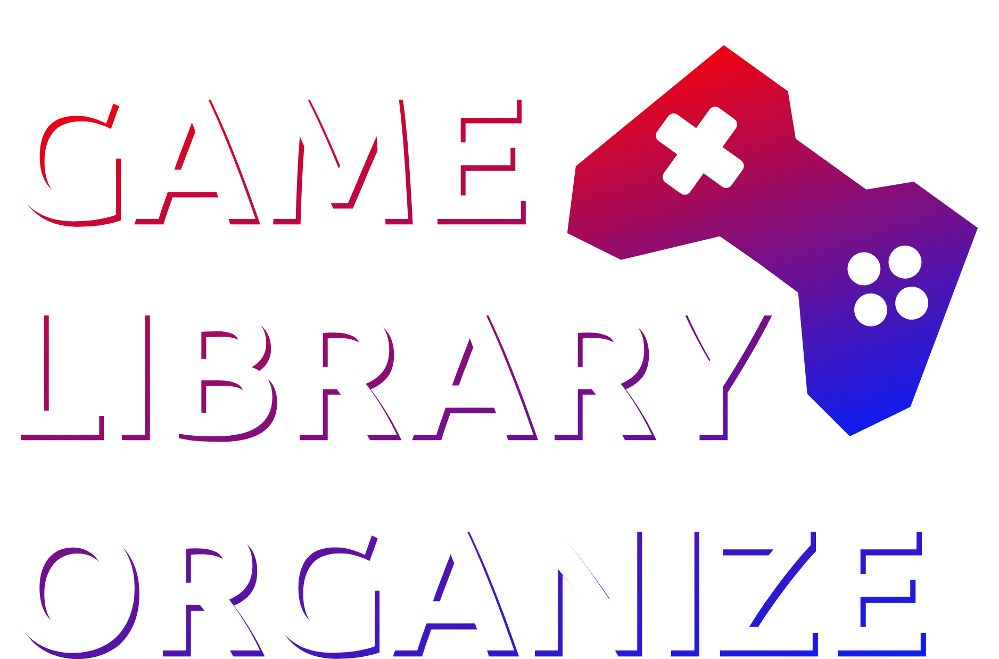

# 🎮 Game Library Organize (GLO)

<p align="center">
  
</p>

<p align="center">
  <strong>Organizador e centralizador visual unificado para suas bibliotecas e coleções de jogos digitais.</strong>
</p>

<p align="center">
  
  
  
  
  
  
  
  
</p>

---

## 📖 Sobre o Projeto

O **Game Library Organize** é uma plataforma desenvolvida para jogadores que possuem jogos espalhados por diversas lojas e plataformas digitais (Steam, Epic Games, GOG, PlayStation Network, Xbox, Nintendo E-Shop, Ubisoft Connect, EA App, Rockstar Games e Amazon Luna) e desejam **centralizar, organizar, acompanhar o progresso, registrar horas jogadas e avaliar títulos** em uma interface aconchegante, altamente responsiva e retrô-moderna.

---

## ✨ Principais Funcionalidades

- 🕹️ **Centralização Multi-Plataforma**: Gerencie jogos de consoles e múltiplos launchers de PC em um só lugar.
- ⚡ **Busca Instantânea com Elasticsearch**:
  - Autocomplete com tokenizer customizado (`edge_ngram`).
  - Filtros combinados por desenvolvedora, publicadora, ano de lançamento, gênero, plataformas e status de progresso.
  - Comando Artisan de reindexação rápida (`php artisan elasticsearch:reindex`).
- 🎨 **Design System Retrô-Moderno & Aconchegante**:
  - Suporte completo a **Dark Mode** e **Light Mode** nativo com troca dinâmica de logos.
  - Paleta de cores semântica com personalização de cores primária e secundária por usuário (`--brand-primary`, `--brand-secondary`).
  - Cards visuais com proporção de capa padrão de cinema/jogos (**2:3**), ratings por estrelas e badges de status (*Finalizado, Jogando, Dropado, Backlog*).
  - Tipografia harmoniosa com Google Fonts: **Ubuntu** (títulos), **Open Sans** (elementos de navegação e botões) e **Roboto** (corpo de texto).
- 🧩 **Arquitetura Modular em Componentes Blade**:
  - Componentes reutilizáveis `<x-head>`, `<x-header>`, `<x-footer>`, `<x-theme-switcher>`, `<x-game.card>`, `<x-game.status-badge>` e `<x-game.star-rating>`.
- 🔐 **Autenticação & Interface Segura**:
  - Tela de login estilizada com efeito retro glow e alternância de visibilidade de senha (mostrar/ocultar).

---

## 🛠️ Stack Tecnológica

| Camada | Tecnologia | Detalhes |
| :--- | :--- | :--- |
| **Backend** | [Laravel 13](https://laravel.com/) | PHP 8.5, Eloquent ORM, Enums tipados, Form Requests |
| **Frontend Reativo** | [Livewire 4](https://livewire.laravel.com/) & [Alpine.js](https://alpinejs.dev/) | Componentes reativos sem necessidade de SPAs complexas |
| **Estilização** | [Tailwind CSS v4](https://tailwindcss.com/) & Vanilla CSS Tokens | CSS Variables reativas com `@theme` Tailwind v4 |
| **Motor de Busca** | [Elasticsearch 8.17](https://www.elastic.co/) | Mapeamento com filtros customizados e Edge NGram |
| **Banco de Dados** | [PostgreSQL 16](https://www.postgresql.org/) | Relacionamentos otimizados, índices e pivots |
| **Ambiente / Container** | [Docker & Docker Compose](https://www.docker.com/) | Containers pré-configurados para App, PostgreSQL e Elasticsearch |
| **Testes Automatizados** | [Pest PHP 5](https://pestphp.com/) | Testes de features, models e integridade arquitetural |
| **Padronização de Código** | [Laravel Pint](https://laravel.com/docs/pint) | PSR-12 e regras de estilo do ecossistema Laravel |

---

## 🚀 Como Executar o Projeto

### 1. Pré-requisitos
- [Docker](https://docs.docker.com/get-docker/) e [Docker Compose](https://docs.docker.com/compose/) **OU**
- PHP >= 8.5, Composer, Node.js >= 20, PostgreSQL 16 e Elasticsearch 8.17 instalados localmente.

---

### 2. Passo a Passo de Inicialização

#### Clonar o repositório
```bash
git clone <url-do-repositorio>
cd game-library-organize
```

#### Configurar as variáveis de ambiente
```bash
cp .env.example .env
```

#### Subir os serviços com Docker Compose
```bash
docker compose up -d
```
> Os seguintes serviços estarão disponíveis:
> - **Aplicação Laravel**: `http://localhost:8000`
> - **PostgreSQL**: `localhost:5432`
> - **Elasticsearch**: `http://localhost:9200`

---

#### Instalar dependências PHP e JavaScript
```bash
composer install
npm install
```

#### Gerar a chave da aplicação e rodar migrações com dados iniciais (Seeders)
```bash
php artisan key:generate
php artisan migrate:fresh --seed
```

#### Indexar os jogos no Elasticsearch
```bash
php artisan elasticsearch:reindex
```

#### Iniciar o servidor de desenvolvimento
```bash
composer run dev
```
> O comando acima inicia simultaneamente o servidor Laravel (`php artisan serve`) e o bundler Vite (`npm run dev`).

Acesse no navegador: **[http://localhost:8000](http://localhost:8000)**

---

## 🧪 Testes Automatizados

O projeto utiliza o framework de testes **Pest PHP**:

```bash
# Executar todos os testes
php artisan test

# Executar com formato compacto
php artisan test --compact
```

---

## 🎨 Formatação de Código

Para garantir o padrão de estilo de código:

```bash
vendor/bin/pint --format agent
```

---

## 📁 Estrutura do Projeto

```plaintext
game-library-organize/
├── app/
│   ├── Console/Commands/       # Comandos Artisan (ElasticsearchReindexCommand, etc.)
│   ├── Enums/                  # Enums nativos (GameStatus, ThemeMode)
│   ├── Models/                 # Eloquent Models (User, Platform, GameLibrary, Game, UserGame)
│   └── Services/Elasticsearch/ # Camada de integração e buscas no Elasticsearch
├── config/                     # Configurações do Laravel e Elasticsearch
├── database/
│   ├── factories/              # Factories para testes e população de dados
│   ├── migrations/             # Migrações do banco de dados relacional (PostgreSQL)
│   └── seeders/                # Seeders com plataformas e bibliotecas padrão
├── public/
│   └── images/                 # Logos de launchers, consoles e temas dark/light
├── resources/
│   ├── css/                    # Variáveis de tema (theme.css) e Tailwind v4 (app.css)
│   ├── js/                     # Scripts de tema dinâmico e visibilidade de senhas
│   └── views/
│       ├── components/         # Componentes Blade modulares (<x-head>, <x-header>, <x-footer>, cards, badges)
│       ├── layouts/            # Layouts base (app, guest)
│       ├── login.blade.php     # Tela de login
│       └── welcome.blade.php   # Landing page de apresentação
├── routes/
│   ├── api.php                 # Rotas de API
│   ├── console.php             # Comandos de console
│   └── web.php                 # Rotas web da aplicação
├── tests/                      # Suíte de testes com Pest PHP
├── docker-compose.yml          # Definição dos containers de desenvolvimento
└── Dockerfile                  # Imagem Docker da aplicação PHP 8.5
```

---

## 📄 Licença

Este projeto é de código aberto e está sob a licença [MIT](LICENSE).
